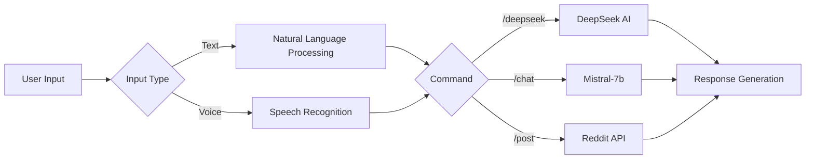

# 🤖 Advanced Telegram Bot with Reddit & AI Integration


A multi-functional Telegram bot combining social media automation, AI interactions, and multilingual capabilities. Built with modern async Python and integrated with cutting-edge APIs.


## 🌟 Featured Capabilities

### 🤖 Core Features
| Category        | Features                                                                 |
|-----------------|--------------------------------------------------------------------------|
| 🚀 Reddit       | Post creation, Smart commenting, Auto-comment system (20min intervals)  |
| 🧠 AI Services  | Dual AI engine (DeepSeek & Mistral-7b), Context-aware responses         |
| 🔊 Voice        | Multi-engine STT (Google/OpenRouter), Text-to-speech (gTTS)            |
| 🌐 Translation  | 100+ languages, ISO 639-1 code support, Batch translation              |
| ⚡ Automation   | Async operations, Rate limiting, Error recovery                        |

### 🎯 Command Highlights
```bash
/post <subreddit> <title> <content>  # Create Reddit post
/auto_comment <subreddit>            # Start smart auto-commenting
/deepseek <question>                 # Query DeepSeek AI
/chat <prompt>                       # Mistral-7b conversation
/voice                               # Convert voice to text (Google)
/voice_openrouter                    # AI-powered voice transcription
/translate <src> <dest> <text>       # Real-time translation
/text_to_voice <lang> <text>         # Generate audio from text
```

## 🚀 Getting Started

### Prerequisites
- Python 3.10+
- Telegram bot token
- Reddit API credentials
- [DeepSeek](https://deepseek.com/) & [OpenRouter](https://openrouter.ai/) API keys

### ⚙️ Installation
```bash
git clone https://github.com/yourusername/telegram-ai-bot.git
cd telegram-ai-bot
python -m venv venv
source venv/bin/activate  # Windows: venv\Scripts\activate
pip install -r requirements.txt
```

## 🔐 Configuration

Create `.env` file with these values (use dummy values for public repos):

```ini
# Telegram Configuration
TELEGRAM_BOT_TOKEN=your_telegram_token_here

# Reddit API Credentials
REDDIT_CLIENT_ID=your_reddit_client_id
REDDIT_CLIENT_SECRET=your_reddit_client_secret
REDDIT_USERNAME=your_reddit_username
REDDIT_PASSWORD=your_reddit_password
REDDIT_USER_AGENT=script:your_app_name:v1.0 (by u/your_username)

# AI API Keys
DEEPSEEK_API_KEY=your_deepseek_api_key
OPENROUTER_API_KEY=your_openrouter_api_key

Security Notes:  
🔒 Never commit real credentials to version control  
🔑 Keep API keys private at all times  
🚫 Add .env to your .gitignore file  

---

### Example .gitignore:
.env

---

## 🧠 AI Architecture


## 🔧 Technical Stack
- **Core Framework**: Python AsyncIO
- **APIs**: 
  - Telegram Bot API
  - Reddit API (PRAW)
  - DeepSeek AI
  - OpenRouter AI
- **Key Libraries**:
  - `aiohttp` - Async HTTP client
  - `gTTS` - Google Text-to-Speech
  - `speech_recognition` - Multi-engine STT
  - `googletrans` - Real-time translation

## 🌐 Translation Support
Supports 100+ languages including:
```python
{
    "en": "English",
    "es": "Spanish",
    "fa": "Persian",
    "zh-CN": "Chinese",
    "ar": "Arabic",
    "ja": "Japanese"
}
```
Use `/languages` to see full list

## 🛠️ Usage Examples

### Reddit Automation
```bash
/post programming "AI Trends 2024" "Exploring latest developments..."
/auto_comment technology
```

### AI Interactions
```bash
/deepseek Explain quantum computing basics
/chat Write Python code for Fibonacci sequence
```

### Voice & Translation
```bash
/text_to_voice en "Hello world! This is synthetic speech"
/translate en fa "Artificial Intelligence"
```

## 🚧 Upcoming Features (Under Active Development)
- **Enhanced AI Memory**: Context-aware conversation history
- **Multi-platform Support**: Discord/WhatsApp integration
- **Advanced Analytics**: User interaction tracking dashboard
- **Image Generation**: DALL-E/Stable Diffusion integration
- **Document Processing**: PDF/Word file analysis
- **Voice Cloning**: Custom voice model support
- **Marketplace**: Plugin system for 3rd-party extensions

## 🔒 Security Practices
1. Environment variable encryption
2. Rate limiting (20min API cooldowns)
3. Input sanitization
4. Async task isolation
5. Comprehensive error logging

## 🤝 Contributing
We welcome contributions! Please follow these steps:
1. Fork the repository
2. Create feature branch (`git checkout -b feature/amazing-feature`)
3. Commit changes (`git commit -m 'Add amazing feature'`)
4. Push to branch (`git push origin feature/amazing-feature`)
5. Open Pull Request

See our [Contribution Guidelines](CONTRIBUTING.md) for details.

## 📜 License
Distributed under MIT License. See [LICENSE](LICENSE) for details.

---

**Important Notes**:
- 🔄 Maintain Reddit API compliance ([Reddit API Rules](https://www.reddit.com/wiki/api))
- 🤖 Follow Telegram bot policies ([Bot Guidelines](https://core.telegram.org/bots/policies))
- ⚠️ Use AI features responsibly
