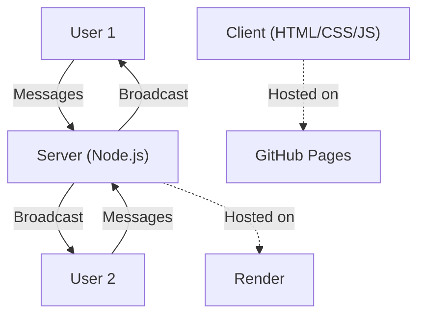

## **📌 README for GitHub (Detailed & Illustrated)**  

# 🌐 Real-Time Chatbox 🚀  

A **real-time chat application** built with **Node.js, Express, and WebSocket**, deployed on **Render**, and hosted on **GitHub Pages**.  

### 🌍 Live Demo: [Real-Time Chatbox](https://real-time-chatbox.onrender.com/)

## **✨ Features**  
✔️ Real-time messaging 📡  
✔️ WebSocket-based communication 🔄  
✔️ Fully responsive UI 🎨  
✔️ Hosted on **Render (Backend)** & **GitHub Pages (Frontend)** 🌍  
✔️ Open-source and easy to deploy 🚀  

---

## **⚡ Quick Setup (Run Locally)**  

### **1️⃣ Clone the Repository**  
```bash
git clone https://github.com/USERNAME/real-time-chatbox.git  
cd real-time-chatbox  
```

### **2️⃣ Install Dependencies**  
```bash
npm install  
```

### **3️⃣ Start the Server**  
```bash
node server.js  
```

✅ Open `http://localhost:3000` in your browser and start chatting! 💬  

---

## **🌍 Deployment (Render & GitHub Pages)**  

### **🚀 Backend Deployment on Render**  
1️⃣ Go to [Render](https://render.com) and create an account.  
2️⃣ Click **New Web Service** and select **Connect a repository**.  
3️⃣ Choose your **GitHub repository** (`real-time-chatbox`) and click **Connect**.  
4️⃣ Set up the service:  
   - **Runtime:** `Node.js`  
   - **Branch:** `main`  
   - **Build Command:**  
     ```bash
     npm install
     ```
   - **Start Command:**  
     ```bash
     node server.js
     ```
   - **Instance Type:** `Free ($0/month)`  
5️⃣ Click **Deploy Web Service** and wait for the deployment to complete.  

🎉 Your server will be live at:  
```bash
https://real-time-chatbox.onrender.com
```

---

### **🌍 Frontend Deployment on GitHub Pages**  
1️⃣ Go to your **GitHub repository** (`real-time-chatbox`).  
2️⃣ Navigate to **Settings > Pages**.  
3️⃣ Under **Source**, select the `main` branch.  
4️⃣ Click **Save**.  

🎉 After a few minutes, your live chat client will be available at:  
```bash
https://USERNAME.github.io/real-time-chatbox/
```

---

## **📊 Architecture Diagram**  


---

## **🛠️ Tech Stack**  
- 🚀 **Node.js** – Backend  
- ⚡ **Express.js** – Server Framework  
- 🔗 **WebSocket** – Real-time Communication  
- ☁ **Render & GitHub Pages** – Hosting  

📬 **Developed by [Amsh] – Open to collaboration!** 🚀  

---

## **📌 نسخه فارسی**  

# 🌐 چت زنده (Real-Time Chatbox) 🚀  

یک **اپلیکیشن چت زنده** ساخته شده با **Node.js، Express و WebSocket** که روی **Render** برای بک‌اند و **GitHub Pages** برای فرانت‌اند دیپلوی شده است.  

### 🌍 مشاهده نسخه زنده: [Real-Time Chatbox](https://real-time-chatbox.onrender.com/)

## **✨ ویژگی‌ها**  
✔️ ارسال و دریافت پیام در لحظه 📡  
✔️ ارتباط با **WebSocket** 🔄  
✔️ رابط کاربری واکنش‌گرا 🎨  
✔️ میزبانی شده روی **Render (بک‌اند)** و **GitHub Pages (فرانت‌اند)** 🌍  
✔️ متن‌باز و قابل استقرار آسان 🚀  

---

## **⚡ نحوه اجرای لوکال**  

### **1️⃣ کلون کردن مخزن**  
```bash
git clone https://github.com/USERNAME/real-time-chatbox.git  
cd real-time-chatbox  
```

### **2️⃣ نصب وابستگی‌ها**  
```bash
npm install  
```

### **3️⃣ اجرای سرور**  
```bash
node server.js  
```

✅ اکنون به `http://localhost:3000` بروید و شروع به چت کنید! 💬  

---

## **🌍 دیپلوی روی Render و GitHub Pages**  

### **🚀 دیپلوی بک‌اند روی Render**  
1️⃣ وارد **[Render](https://render.com)** شوید و حساب کاربری بسازید.  
2️⃣ روی **New Web Service** کلیک کرده و **Connect a repository** را انتخاب کنید.  
3️⃣ مخزن **GitHub** خود (`real-time-chatbox`) را انتخاب کرده و **Connect** بزنید.  
4️⃣ تنظیمات را وارد کنید:  
   - **Runtime:** `Node.js`  
   - **Branch:** `main`  
   - **Build Command:**  
     ```bash
     npm install
     ```
   - **Start Command:**  
     ```bash
     node server.js
     ```
   - **Instance Type:** `Free ($0/month)`  
5️⃣ روی **Deploy Web Service** کلیک کنید و صبر کنید تا سرور اجرا شود.  

🎉 سرور آنلاین شما در این آدرس خواهد بود:  
```bash
https://real-time-chatbox.onrender.com
```

---

### **🌍 دیپلوی فرانت‌اند روی GitHub Pages**  
1️⃣ به مخزن **GitHub** خود (`real-time-chatbox`) بروید.  
2️⃣ به **Settings > Pages** بروید.  
3️⃣ در **Source**، گزینه `main` را انتخاب کنید.  
4️⃣ روی **Save** کلیک کنید.  

🎉 بعد از چند دقیقه، کلاینت آنلاین شما در این آدرس در دسترس خواهد بود:  
```bash
https://USERNAME.github.io/real-time-chatbox/
```

