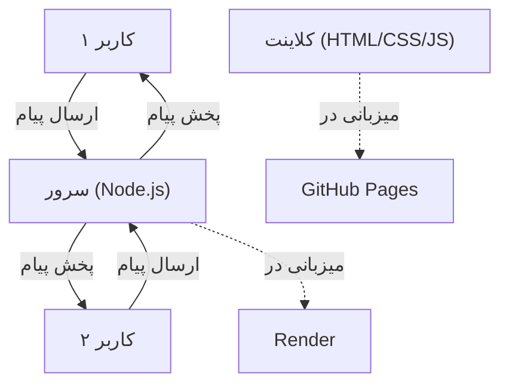

---

## **📌 README (Detailed & Illustrated)**  

# 🌐 Real-Time Chatbox 🚀  

یک چت روم پیشرفته با امکان چت خصوصی و گروهی، آپلود فایل و رابط کاربری زیبا

### 🌍 Live Demo: [Real-Time Chatbox](https://real-time-chatbox.onrender.com/)

## **✨ Features**  
✔️ چت در زمان واقعی با Socket.IO  
✔️ قابلیت ایجاد و مدیریت گروه‌ها  
✔️ امکان آپلود فایل (تصویر، ویدیو، PDF)  
✔️ رابط کاربری ریسپانسیو  
✔️ پشتیبانی از حالت تاریک/روشن  
✔️ نمایش کاربران آنلاین  
✔️ پشتیبانی کامل از زبان فارسی  

---

## **⚡ Quick Setup (Run Locally)**  

### **1️⃣ Clone the Repository**  
```bash
git clone https://github.com/YOUR_USERNAME/Real-Time-chatbox.git  
cd Real-Time-chatbox  
```

### **2️⃣ Install Dependencies**  
```bash
npm install  
```

### **3️⃣ Create Configuration File**  
Create a `.env` file in the root of the project:
```
PORT=3000
NODE_ENV=development
FRONTEND_URL=http://localhost:3000
```

### **4️⃣ Start the Server**  
```bash
npm start  
```

✅ Open `http://localhost:3000` in your browser and start chatting! 💬  

---

## **🌍 Deployment (Render & GitHub Pages)**  

### **🚀 Backend Deployment on Render**  
1️⃣ Go to [Render](https://render.com) and create an account.  
2️⃣ Click **New Web Service** and select **Connect a repository**.  
3️⃣ Choose your **GitHub repository** (`Real-Time-chatbox`) and click **Connect**.  
4️⃣ Set up the service:  
   - **Runtime:** `Node`  
   - **Branch:** `main`  
   - **Build Command:**  
     ```bash
     npm install
     ```
   - **Start Command:**  
     ```bash
     npm start
     ```
   - **Instance Type:** `Free ($0/month)`  
5️⃣ Click **Deploy Web Service** and wait for the deployment to complete.  

🎉 Your server will be live at:  
```bash
https://real-time-chatbox.onrender.com
```

---

### **🌍 Frontend Deployment on GitHub Pages**  
1️⃣ Go to your **GitHub repository** (`Real-Time-chatbox`).  
2️⃣ Navigate to **Settings > Pages**.  
3️⃣ Under **Source**, select the `main` branch.  
4️⃣ Click **Save**.  

🎉 After a few minutes, your live chat client will be available at:  
```bash
https://USERNAME.github.io/Real-Time-chatbox/
```

---

## **📊 Architecture Diagram**  


---

## **🛠️ Tech Stack**  
- 🚀 **Node.js** – Backend  
- ⚡ **Express.js** – Server Framework  
- 🔗 **WebSocket** – Real-time Communication  
- ☁ **Render & GitHub Pages** – Hosting  

📬 **Developed by [Amsh] – Open to collaboration!** 🚀  

---

## **📌 نسخه فارسی**  

# 🌐 چت زنده (Real-Time Chatbox) 🚀  

یک چت روم پیشرفته با امکان چت خصوصی و گروهی، آپلود فایل و رابط کاربری زیبا

### 🌍 مشاهده نسخه زنده: [Real-Time Chatbox](https://real-time-chatbox.onrender.com/)

## **✨ ویژگی‌ها**  
✔️ چت در زمان واقعی با Socket.IO  
✔️ قابلیت ایجاد و مدیریت گروه‌ها  
✔️ امکان آپلود فایل (تصویر، ویدیو، PDF)  
✔️ رابط کاربری ریسپانسیو  
✔️ پشتیبانی از حالت تاریک/روشن  
✔️ نمایش کاربران آنلاین  
✔️ پشتیبانی کامل از زبان فارسی  

---

## **⚡ نحوه اجرای لوکال**  

### **1️⃣ کلون کردن مخزن**  
```bash
git clone https://github.com/YOUR_USERNAME/Real-Time-chatbox.git  
cd Real-Time-chatbox  
```

### **2️⃣ نصب وابستگی‌ها**  
```bash
npm install  
```

### **3️⃣ ساخت فایل تنظیمات**  
یک فایل `.env` در روت پروژه بسازید:
```
PORT=3000
NODE_ENV=development
FRONTEND_URL=http://localhost:3000
```

### **4️⃣ اجرای برنامه**  
```bash
npm start  
```

✅ اکنون به `http://localhost:3000` بروید و شروع به چت کنید! 💬  

---

## **🌍 دیپلوی روی Render و GitHub Pages**  

### **🚀 دیپلوی بک‌اند روی Render**  
1️⃣ وارد **[Render](https://render.com)** شوید و حساب کاربری بسازید.  
2️⃣ روی **New Web Service** کلیک کرده و **Connect a repository** را انتخاب کنید.  
3️⃣ مخزن **GitHub** خود (`Real-Time-chatbox`) را انتخاب کرده و **Connect** بزنید.  
4️⃣ تنظیمات را وارد کنید:  
   - **Runtime:** `Node`  
   - **Branch:** `main`  
   - **Build Command:**  
     ```bash
     npm install
     ```
   - **Start Command:**  
     ```bash
     npm start
     ```
   - **Instance Type:** `Free ($0/month)`  
5️⃣ روی **Deploy Web Service** کلیک کنید و صبر کنید تا سرور اجرا شود.  

🎉 سرور آنلاین شما در این آدرس خواهد بود:  
```bash
https://real-time-chatbox.onrender.com
```

---

### **🌍 دیپلوی فرانت‌اند روی GitHub Pages**  
1️⃣ به مخزن **GitHub** خود (`Real-Time-chatbox`) بروید.  
2️⃣ به **Settings > Pages** بروید.  
3️⃣ در **Source**، گزینه `main` را انتخاب کنید.  
4️⃣ روی **Save** کلیک کنید.  

🎉 بعد از چند دقیقه، کلاینت آنلاین شما در این آدرس در دسترس خواهد بود:  
```bash
https://USERNAME.github.io/Real-Time-chatbox/
```

---

## **📊 دیاگرام معماری**  


---

## **🛠️ تکنولوژی‌های استفاده شده**  
- 🚀 **Node.js** – بک‌اند  
- ⚡ **Express.js** – فریم‌ورک سرور  
- 🔗 **WebSocket** – ارتباط زنده  
- ☁ **Render & GitHub Pages** – میزبانی  

📬 **توسعه داده شده توسط [Amsh] – آماده همکاری!** 🚀  

---

## **لایسنس**

MIT
